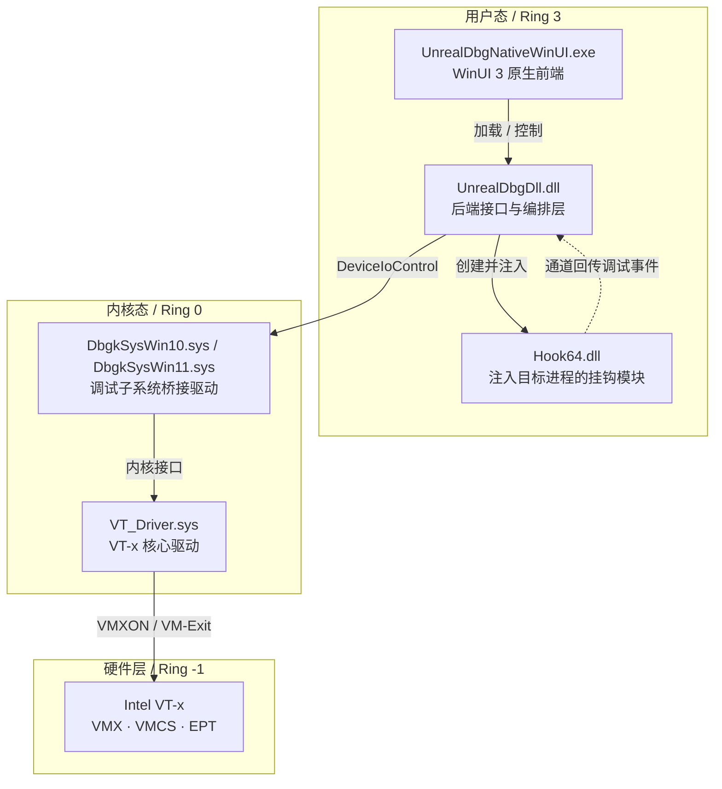
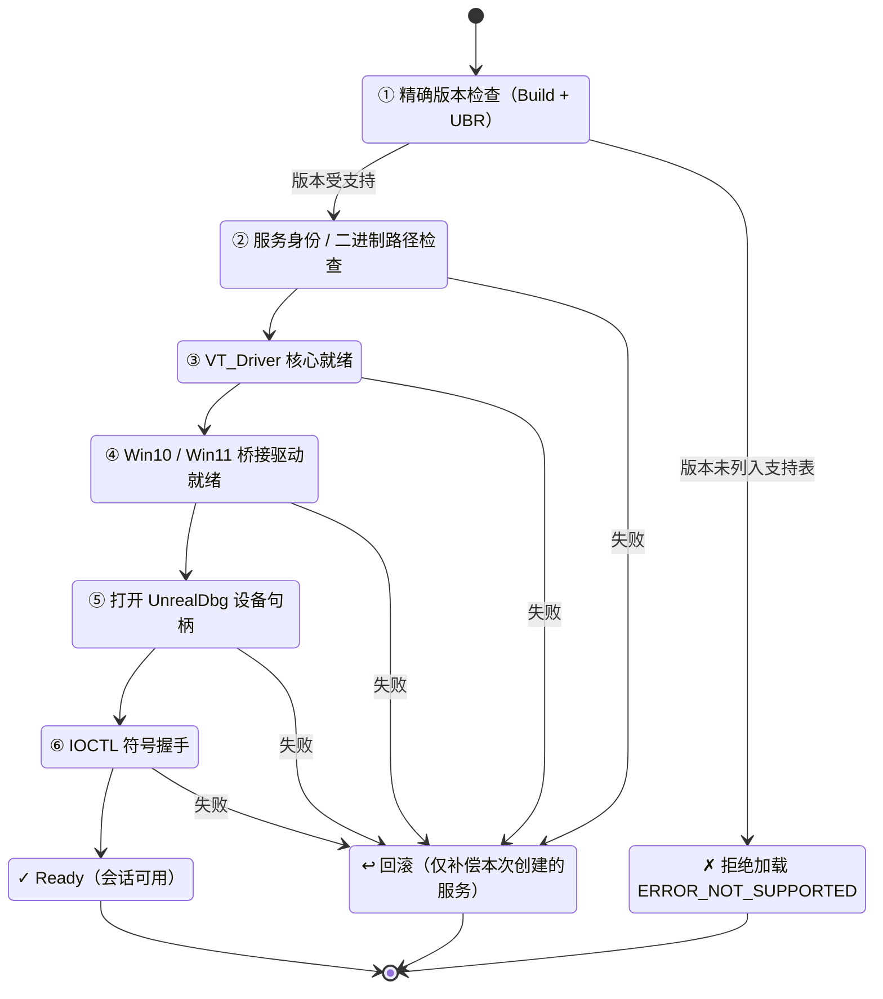
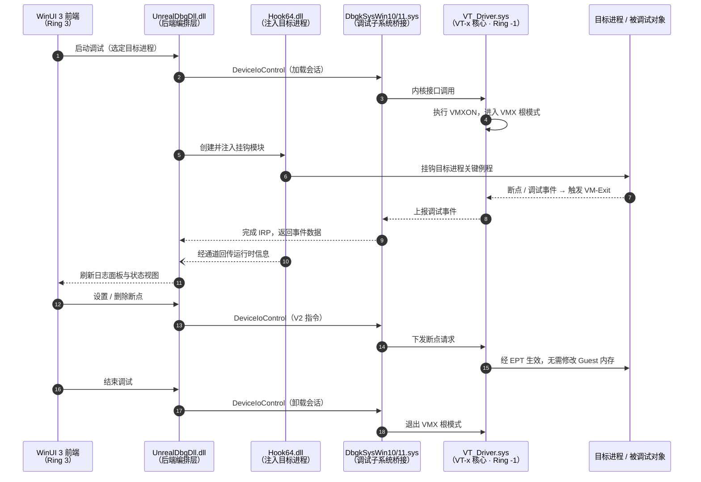

# UnrealDbg

> 基于 Intel VT-x 硬件虚拟化技术的原生 Windows 内核调试器

[](LICENSE)
[](#五系统要求)
[](#七编译指南)
[](#七编译指南)
[](#二核心特性)

---

## 目录

- [一、项目简介](#一项目简介)
- [二、核心特性](#二核心特性)
- [三、系统架构](#三系统架构)
- [四、工作原理](#四工作原理)
  - [4.1 硬件虚拟化层（VT-x）](#41-硬件虚拟化层vt-x)
  - [4.2 调试子系统桥接](#42-调试子系统桥接)
  - [4.3 IOCTL 通信协议](#43-ioctl-通信协议)
  - [4.4 驱动事务状态机](#44-驱动事务状态机)
  - [4.5 端到端调用流程](#45-端到端调用流程)
- [五、系统要求](#五系统要求)
- [六、目录结构](#六目录结构)
- [七、编译指南](#七编译指南)
- [八、运行与使用](#八运行与使用)
- [九、日志与诊断](#九日志与诊断)
- [十、安全说明](#十安全说明)
- [十一、常见问题](#十一常见问题)
- [十二、参与贡献](#十二参与贡献)
- [十三、许可证](#十三许可证)
- [十四、致谢](#十四致谢)
- [十五、交流与社区](#十五交流与社区)

---

## 一、项目简介

**UnrealDbg** 是一款完全开源的 Windows 内核级调试器，通过 **Intel VT-x 硬件虚拟化**（Virtualization Technology）在 Ring -1 层构建虚拟机监视器（Hypervisor），从硬件层面接管处理器的调试能力，从而实现对目标进程的**透明、高权限、难以检测与对抗**的调试。

与传统用户态调试器（依赖 `DebugActiveProcess` 等系统接口）或纯内核调试器（依赖内核回调）不同，UnrealDbg 将调试逻辑下沉到 VMX Root 模式：

- 调试断点由 **VM-Exit 事件**触发，而非软件 `INT3` 指令替换；
- 内存访问由 **EPT（扩展页表）**控制，可实现隐藏断点与内存隔离；
- 调试子系统调用由**桥接驱动**按目标系统版本精确适配，避免依赖脆弱的硬编码偏移。

当前版本提供全新的**原生 WinUI 3 C++ 前端**（完全基于 XAML 原生控件，不嵌入任何 WebView），后端继续沿用成熟的 `UnrealDbgDll` 接口与驱动协议，功能与稳定性不受界面重构影响。

---

## 二、核心特性

| 特性 | 说明 |
|------|------|
| **VT-x 硬件虚拟化** | 基于 Intel VMX / VMCS / EPT 构建 Hypervisor，在 Ring -1 层拦截调试事件，不依赖软件断点 |
| **原生 WinUI 3 界面** | C++ 原生 XAML 控件，暗黑主题，单页状态概览 + 调试器列表 + TL 选项 + 底部实时分级日志 |
| **Windows 版本精确适配** | 按 Windows **Build + UBR** 精确匹配 Win10 / Win11 桥接驱动，未知版本在加载任何驱动前拒绝 |
| **驱动事务状态机** | 驱动分阶段加载，任一阶段失败均回滚本次创建的服务并给出可操作的错误诊断 |
| **V2 IOCTL 安全协议** | 设备通过受控 ACL 访问，V2 指令要求显式读写句柄权限，V1 保留兼容旧客户端 |
| **符号缓存管理** | PDB / EXP / LIB 调试符号管理，记录系统模块文件版本与 CodeView GUID/Age，版本变化自动失效重验 |
| **完整的诊断体系** | 分级日志、单进程会话日志、只读环境快照、一键式诊断包采集 |
| **多调试器集成** | 支持注册并启动多个外部调试器（如 x64dbg） |
| **TL 反调试缓解** | 可选 `GetTickCount` 挂钩与目标进程线程阻塞 |

---

## 三、系统架构

UnrealDbg 采用**五层架构**，用户态、内核态与硬件层职责清晰分离：



**各层职责：**

| 层级 | 组件 | 职责 |
|------|------|------|
| 用户态 · 界面 | `UnrealDbgNativeWinUI.exe` | XAML 界面、状态展示、用户交互、日志呈现 |
| 用户态 · 后端 | `UnrealDbgDll.dll` | 驱动加载编排、符号下发、进程启动、TL 选项控制 |
| 用户态 · 注入 | `Hook64.dll` | 注入目标进程，挂钩调试相关 API，经通道回传事件 |
| 内核态 · 桥接 | `DbgkSysWin10/11.sys` | 按系统版本适配调试子系统调用与内核结构偏移 |
| 内核态 · 核心 | `VT_Driver.sys` | VMX 初始化、EPT 映射、VM-Exit 处理、VMCALL 服务 |
| 硬件层 | Intel VT-x | 提供 VMX 根/非根模式切换与扩展页表能力 |

---

## 四、工作原理

### 4.1 硬件虚拟化层（VT-x）

`VT_Driver.sys` 通过执行 `VMXON` 指令使处理器进入 VMX 操作模式，将当前操作系统置于 **VMX 非根模式（Non-Root）**，调试器自身运行于 **VMX 根模式（Root）**。关键组件包括：

- **VMCS（虚拟机控制结构）**：保存 Guest / Host 状态，配置 VM-Exit 触发条件；
- **EPT（扩展页表）**：二级地址转换，用于内存隐藏、访问拦截与断点实现；
- **VM-Exit 处理**：捕获断点异常、调试寄存器访问、指令执行等事件；
- **VMCALL**：用户态经驱动向 Hypervisor 发起的超调用，用于控制与查询。

### 4.2 调试子系统桥接

Windows 的调试能力由内核的 `Dbgk*`（调试子系统）接口提供，其内部结构偏移随系统版本变化。UnrealDbg 因此为 **Windows 10** 与 **Windows 11** 分别维护独立的桥接驱动：

- 加载前由 `RtlGetVersion` 读取真实内核版本，并结合注册表 `UBR` 精确匹配；
- 仅当 Build + UBR 落在支持表内，才加载对应的桥接驱动；
- 未列出的系统版本在**加载任何驱动之前**返回 `ERROR_NOT_SUPPORTED`，杜绝盲猜偏移导致的蓝屏。

### 4.3 IOCTL 通信协议

前端与驱动通过 `DeviceIoControl` 通信，指令定义于 `Common/Shared/IOCTLs.h`：

| 功能 | V1 指令码 | V2 指令码 |
|------|:--------:|:--------:|
| 加载符号表 | `0x800` | `0x900` |
| 加载调试器状态 | `0x801` | `0x901` |
| 加载保护对象数据 | `0x802` | `0x902` |
| 加载调试器数据 | `0x803` | `0x903` |
| 创建远程线程 | `0x804` | `0x904` |
| 设置硬件断点 | `0x805` | `0x905` |
| 获取进程信息 | `0x806` | `0x906` |
| 阻塞恢复线程 | `0x807` | `0x907` |
| 删除硬件断点 | `0x808` | `0x908` |
| 设置软件断点 | `0x809` | `0x909` |
| 删除软件断点 | `0x80A` | `0x90A` |
| 读取软件断点 | `0x80B` | `0x90B` |

**V2 与 V1 的区别**：V2 指令要求调用方持有具备读写权限的设备句柄（`FILE_READ_DATA | FILE_WRITE_DATA`），提升了越权访问的门槛；V1 保留用于兼容尚未升级的旧客户端。

### 4.4 驱动事务状态机

驱动加载遵循严格的事务化状态机，保证失败可追溯、可回滚：



任一阶段失败均记录：**阶段名、Win32 错误码、系统原文、失败原因、解决建议**。

- 桥接阶段失败时，**仅补偿本次创建的服务**，不影响已有实例；
- 若 VT 核心已进入 VMX 状态，程序**不会未经验证地强制卸载**，而是明确提示需要重启恢复，避免系统不稳定。

> 第 ⑤ 步打开的是设备 `\\.\UnrealDbg`；第 ⑥ 步的符号握手用于校验前后端协议版本与符号表一致性。

### 4.5 端到端调用流程

下图示意一次调试会话从启动、断点触发到结束的完整链路（其中 Ring 0 与 Ring -1 的协作为本项目的核心设计）：



> 说明：图中 V2 指令要求设备句柄具备 `FILE_READ_DATA | FILE_WRITE_DATA` 权限；`HK--)DLL` 的虚线表示挂钩模块主动回传的事件通道。

---

## 五、系统要求

### 5.1 Windows 版本支持

| Build | 系统版本 | 桥接驱动 | 当前状态 |
|------:|----------|----------|----------|
| 19045 | Windows 10 22H2 | `DbgkSysWin10.sys` | 开发基线 |
| 22000 | Windows 11 21H2 | `DbgkSysWin11.sys` | 开发基线 |
| 22621 | Windows 11 22H2 | `DbgkSysWin11.sys` | 开发基线 |
| 22631 | Windows 11 23H2 | `DbgkSysWin11.sys` | 开发基线 |
| 26100 | Windows 11 24H2 | `DbgkSysWin11.sys` | 开发基线 |
| 26200 | Windows 11 25H2 | `DbgkSysWin11.sys` | 当前开发基线 |
| 其他 | 任意未列版本 | — | **加载前拒绝**，返回 `ERROR_NOT_SUPPORTED` |

> **「开发基线」不等于正式兼容承诺。** 只有当兼容性矩阵中的 CPU、Hyper-V/VBS/HVCI、签名与重启用例全部通过后，条目才可标记为「已验证」。Windows 更新导致 Build 变化后，必须重新执行完整矩阵。

### 5.2 硬件与软件要求

**硬件**
- 支持 **Intel VT-x** 的处理器（需在 BIOS/UEFI 中启用虚拟化）
- 支持 **EPT（Extended Page Tables）**，即 Intel Nehalem 及以后的处理器

**软件**
- Windows 10 22H2 或 Windows 11（详见上表）
- **Windows App Runtime 1.8 x64**（运行 WinUI 3 前端所必需）
- 管理员权限（驱动加载与调试能力均依赖提升权限）

**编译环境**
- Visual Studio 2019（v142 工具集）
- Windows Driver Kit（WDK）
- Windows App SDK / C++/WinRT（构建 WinUI 前端）

---

## 六、目录结构

```
UnrealDbg/
├── UnrealDbg.sln                  # Visual Studio / WDK 解决方案
├── README.md                      # 项目说明（本文件）
├── LICENSE                        # GNU GPL v3.0 许可证
├── 启动GUI.bat                     # 一键启动前端
├── 构建并验证GUI.bat               # 一键构建并验证
│
├── VT_Driver/                     # ★ VT-x 核心驱动源码
│   ├── vmm.cpp / vmm.h            #   虚拟机监视器主循环
│   ├── vmcs.cpp / vmcs.h          #   VMCS 字段配置
│   ├── vmexit_handler.cpp         #   VM-Exit 原因分发
│   ├── EPT.cpp / EPT.h            #   扩展页表与内存隐藏
│   ├── vmcall_handler.cpp         #   VMCALL 超调用处理
│   ├── poolmanager.cpp            #   内核池内存管理
│   ├── spinlock.cpp               #   自旋锁同步
│   └── ASM/                       #   VMX 启动/退出汇编桩
│
├── DbgkSysWin10/                  # ★ Windows 10 调试子系统桥接驱动
├── DbgkSysWin11/                  # ★ Windows 11 调试子系统桥接驱动
│
├── Hook/                          # ★ 注入目标的挂钩 DLL（Hook64.dll）
│   ├── Channels/                  #   前后端通信通道
│   ├── DebugBreak/                #   断点逻辑
│   ├── DebugEvent/                #   调试事件处理
│   └── HookCallSet/               #   挂钩函数集合
│
├── Loader/                        # ★ 驱动加载器（Loader.exe）
├── UnrealDbgDll/                  # ★ 后端接口层（UnrealDbgDll.dll）
│
├── UnrealDbgNative/               # ★ 原生 WinUI 3 前端（核心新模块）
│   ├── WinUiMain.cpp              #   界面入口与 XAML 构建
│   ├── WinUiController.cpp/.h     #   后端编排控制器
│   ├── Core.cpp/.h                #   日志/错误解释/路径/权限/诊断
│   ├── LogPanel.cpp/.h            #   底部实时分级日志面板
│   ├── SymbolCache.cpp/.h         #   符号缓存管理
│   ├── UiComponents / UiTheme.h   #   UI 组件与暗黑主题
│   └── RestoreWinUiPackages.ps1   #   NuGet 依赖恢复脚本
│
├── Common/                        # 共享代码库
│   ├── Detours/                   #   Detours API Hook
│   ├── Encrypt/Blowfish/          #   Blowfish 加密
│   ├── Hash/                      #   MD5 / CRC32
│   ├── IPC/SharedMemory/          #   共享内存 IPC
│   ├── Ring0/                     #   内核态共享代码（Hvm/PE/SymbolicAccess 等）
│   └── Shared/IOCTLs.h            #   IOCTL 协议定义
│
├── UnrealDbg/                     # 旧版 Delphi 前端源码（已归档）
├── D-encryption/                  # 文件加密工具（Delphi）
├── D-encryptiondll/               # 加密工具 DLL 版
├── CardRegistration/              # 卡密注册工具（Delphi）
├── SymbolTool/                    # 符号管理工具（Delphi）
│
├── docs/                          # 项目文档
│   ├── 项目架构与开发指南.md
│   ├── Windows支持与发布策略.md
│   ├── 签名工具Hook原理分析.md
│   └── Git发布清单.md
├── tests/windows/                 # 测试脚本与兼容性矩阵
└── x64/                           # 编译输出目录（构建后生成，不纳入版本控制）
    ├── Debug/  Release/           #   运行目录（bin / Config / Symbols / Log）
    └── WinUI/                     #   WinUI 前端构建输出
```

**运行目录约定：**

| 路径 | 内容 |
|------|------|
| `x64\*\bin` | 运行时 DLL、注入组件与 SYS 驱动；程序优先从此加载 |
| `x64\*\Config` | `copyright.db`、`DebuggerList.ini`、`Config.ini` 等配置 |
| `x64\*\Symbols` | PDB / EXP / LIB 等调试与链接文件，不参与运行 |
| `x64\*\Certificates` | 驱动测试证书，仅安装或签名时需要 |
| `x64\*\Log` | 程序运行日志 |

---

## 七、编译指南

### 7.1 环境准备

1. 安装 **Visual Studio 2019**（勾选「使用 C++ 的桌面开发」工作负载）。
2. 安装匹配版本的 **Windows Driver Kit（WDK）**。
3. 安装 **Windows App Runtime 1.8 x64**（运行与调试 WinUI 前端所需）。

### 7.2 恢复 WinUI 编译依赖

首次构建前需恢复 NuGet 包，否则 C++/WinRT 投影头无法生成：

```powershell
powershell -ExecutionPolicy Bypass -File UnrealDbgNative\RestoreWinUiPackages.ps1
```

脚本会从 NuGet 拉取 Windows App SDK 与 CppWinRT 包。**前端不使用 WebView**。

### 7.3 构建

1. 用 Visual Studio 打开 `UnrealDbg.sln`；
2. 选择 **x64** 平台与 **Release** 配置；
3. 构建 `UnrealDbgNativeWinUI.vcxproj`（以及所需的驱动项目）；
4. 构建产物位于 `x64\WinUI\Release\`，运行所需的 DLL/SYS 集中于 `bin` 子目录。

> 也可直接运行 `构建并验证GUI.bat` 完成构建与验证。

---

## 八、运行与使用

### 8.1 启动

```bat
:: 方式一：直接运行
x64\WinUI\Release\UnrealDbgNativeWinUI.exe

:: 方式二：使用批处理
启动GUI.bat
```

程序会自动解析 `bin`、`Config` 目录，并兼容旧版根目录布局，无需手动切换工作目录。

### 8.2 主要功能

- **状态概览**：展示系统版本、CPU、内存、架构与驱动状态；
- **调试器列表**：注册、删除并启动多个外部调试器（如 x64dbg）；
- **TL 选项**：控制 `GetTickCount` 挂钩与目标进程线程阻塞；
- **实时日志**：底部面板按级别着色显示（调试 / 信息 / 错误）；
- **目标选择**：可选择前台窗口对应的进程作为调试目标。

### 8.3 自检模式

```bat
UnrealDbgNativeWinUI.exe --self-test
```

执行纯核心自检：**不加载驱动、不注入 DLL、不改动文件、无需管理员权限**。

---

## 九、日志与诊断

### 9.1 日志文件

| 文件 | 内容 | 轮转策略 |
|------|------|----------|
| `Log\log.ini` | 前端滚动汇总日志 | 达 16 MB 轮转为 `log.previous.ini` |
| `Log\Sessions\UnrealDbg-*.log` | 前端单进程完整会话 | 单文件上限 64 MB |
| `Log\UnrealDbgDll.log` | 后端滚动汇总日志 | — |
| `Log\Sessions\UnrealDbgDll-*.log` | 后端独立会话日志 | 单文件上限 64 MB |

驱动调试输出采用 **`UDBG-UTF8/1`** 行协议，文本按 UTF-8 解释，包含组件、时间、级别与状态码。

### 9.2 环境快照

前端会在关键阶段（启动完成、进入 VT 前、符号准备失败后、VT 初始化成功/失败后）记录**只读环境快照**：Windows Build/UBR、管理员状态、VT/Hypervisor/VBS/HVCI/安全启动状态、运行时文件的路径/大小/修改时间/SHA-256，以及相关服务状态。

### 9.3 诊断包采集

```powershell
powershell -NoProfile -ExecutionPolicy Bypass -File tests\windows\Collect-DriverDiagnostics.ps1
```

采集过程**只读**，不会加载驱动或更改任何系统安全设置。诊断包包含：最近会话日志、运行时文件 SHA-256 与签名状态、服务配置与状态、近七天服务控制管理器与代码完整性事件、系统/CPU/Device Guard 状态及采集清单。

---

## 十、安全说明

- **权限模型**：设备 ACL 仅允许 `SYSTEM` 与内置 `Administrators` 访问；V2 IOCTL 需显式读写句柄。
- **密钥保护**：后端初始化密钥始终脱敏，**不会写入任何日志或诊断包**。
- **不规避系统安全机制**：本项目**不通过**关闭 HVCI、关闭安全启动或永久启用 TESTSIGNING 来规避驱动签名错误（如 577）。上述设置仅可在明确隔离的开发虚拟机中使用。
- **签名路线**：
  - *开发测试*：隔离快照虚拟机 + 测试证书（须导入「受信任的根证书颁发机构」与「受信任的发布者」）；
  - *正式发布*：采用 Microsoft 认可的内核驱动签名流程（硬件开发者中心 Attestation 或 WHQL），并对 SYS / CAT / INF 及发布包做哈希记录。
- **测试隔离**：所有真实驱动加载测试均在**可回滚的快照虚拟机**中执行；宿主机与 CI 默认只执行预检、自检与符号缓存检查。

---

## 十一、常见问题

<details>
<summary><b>启动时报「权限不足」或驱动加载失败？</b></summary>

请以**管理员身份**运行程序。驱动加载与调试能力均依赖提升权限，界面会将「权限」与「后端」状态分开显示以便定位。
</details>

<details>
<summary><b>提示 <code>ERROR_NOT_SUPPORTED</code>？</b></summary>

当前系统 Build + UBR 不在支持表内。请对照[第五节](#五系统要求)确认系统版本，或等待对应版本适配。
</details>

<details>
<summary><b>前端提示缺少 Windows App Runtime？</b></summary>

请安装 **Windows App Runtime 1.8 x64** 后重试。
</details>

<details>
<summary><b>构建时报找不到 C++/WinRT 投影头？</b></summary>

先执行 `UnrealDbgNative\RestoreWinUiPackages.ps1` 恢复 NuGet 依赖，再重新构建。
</details>

<details>
<summary><b>驱动签名错误 577 如何解决？</b></summary>

请使用合法签名流程（测试证书或正式签名）。**不要**通过关闭 HVCI / 安全启动或永久启用 TESTSIGNING 规避，这些做法会削弱系统安全性，仅限隔离开发环境使用。
</details>

<details>
<summary><b>为什么界面必须用原生 WinUI，而不是 WebView？</b></summary>

原生 XAML 控件可避免 WebView 带来的额外运行时依赖、渲染开销与潜在攻击面，同时获得更好的系统一致性与性能表现。
</details>

---

## 十二、参与贡献

欢迎任何形式的贡献——无论是新功能、Bug 修复、文档改进还是版本适配：

1. Fork 本仓库；
2. 创建特性分支（`git checkout -b feature/your-feature`）；
3. 提交改动（`git commit -m 'feat: 添加某功能'`）；
4. 推送分支（`git push origin feature/your-feature`）；
5. 发起 Pull Request。

> 提交驱动相关改动时，请附上在隔离虚拟机中的验证结果与日志。

---

## 十三、许可证

本项目基于 **GNU General Public License v3.0** 发布，详见 [LICENSE](LICENSE)。

本项目包含的第三方组件（如 Detours、ia32-doc、Phnt、TinyXML、jsoncpp 等）遵循其各自的许可证，详见对应目录内的许可文件。

---

## 十四、致谢

- 感谢 [Detours](https://github.com/microsoft/Detours) 提供的 API Hook 能力；
- 感谢 [ia32-doc](https://github.com/wbenny/ia32-doc) 提供的 Intel 指令集与 VMX 结构定义；
- 感谢 [Phnt](https://github.com/winsiderss/phnt) 提供的 NT 内核接口定义；
- 感谢所有为本项目提交 Issue 与 Pull Request 的贡献者。

---

## 十五、交流与社区

<div align="center">

<p><strong>遇到问题？欢迎加群交流 —— 版本更新与问题答疑第一时间同步</strong></p>

<p>
<a href="https://qm.qq.com/q/89nIPLRrCU" title="易语言 + AI - 吹牛逼（群号 607124662）"></a>
&nbsp;&nbsp;
<a href="https://qm.qq.com/q/Fv9KjpGCEq" title="易语言 · jadeView 前端 UI（群号 1103426302）"></a>
</p>

<p>
<strong>易语言 + AI - 吹牛逼</strong> ｜ 群号 <code>607124662</code><br>
<strong>易语言 · jadeView 前端 UI</strong> ｜ 群号 <code>1103426302</code>
</p>

<p><sub>点击上方按钮即可一键加群，无需手动搜索群号</sub></p>

</div>

---

<div align="center">

**UnrealDbg** — 让内核调试更深、更稳、更难被察觉。

</div>
